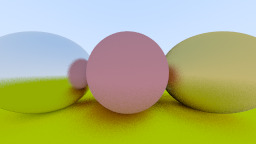

# Peter Shirley's Ray Tracer in One Weekend
This is an implementation of a basic raytracer written in C++, designed to generate high-quality physics-based images of 3D scenes by tracing rays of light as they interact with objects in the scene. This project follows the book "Ray Tracer in One Weekend" by Peter Shirley.

## Features

Ray Tracing: the implementation uses a path tracing-based algorithm.

Geometric Primitives: the geometric primitives supported is that of a sphere.

Materials: Different materials can be assigned to objects, including metal, diffuse (Lambertian) and dielectrics.

Antialiasing: Use pixel sampling to reduce jaggies from the image.

## Build with CMake

This project uses CMake build generator. 

Build using the following steps:
```
$ mkdir build
$ cd build
$ cmake ..
$ make
```

Generate and view image:
```
$ ./RayTracer > img.ppm
$ feh img.ppm
```

## Sample output image

The following is an output with several materials: two Lambertian spheres and two metal ones.


